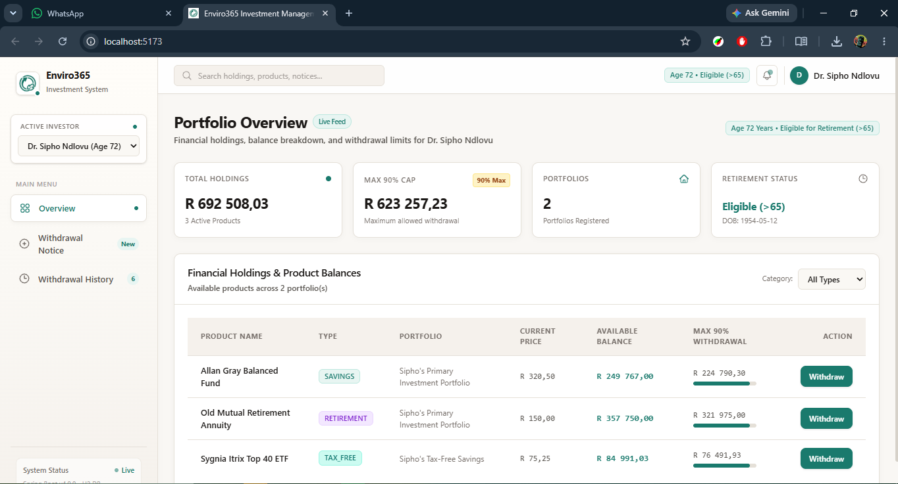
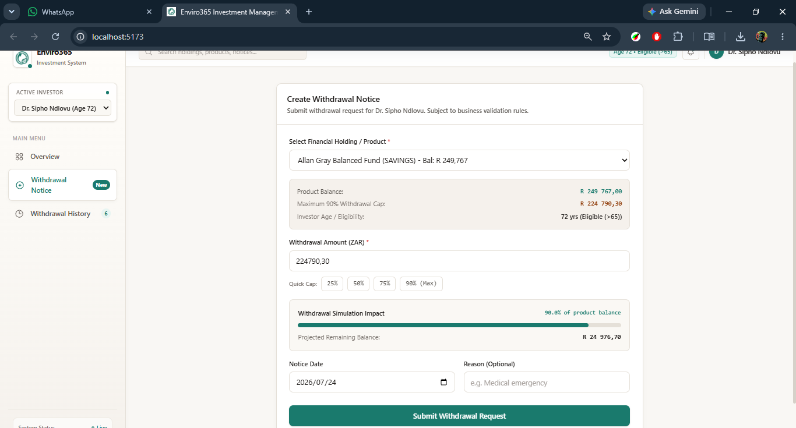
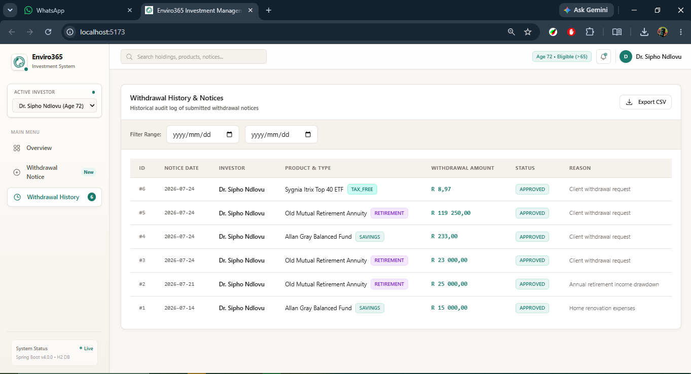
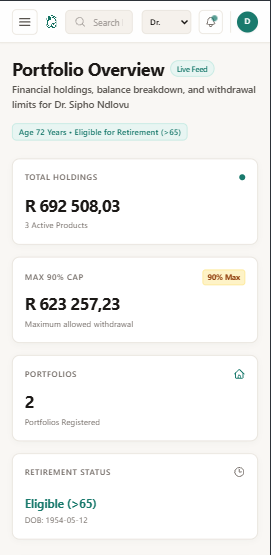

# 📸 Enviro365 System Screenshots & Visual Documentation

Visual walkthrough of the Enviro365 Investment Management System featuring the warm paper-cream & forest teal green fintech design system.

---

## 1. Portfolio Overview Dashboard

### Highlights
- **4 Metric Stat Cards**: Displays Total Holdings Value, Maximum 90% Withdrawal Cap, Registered Portfolios, and Retirement Eligibility Status.
- **Financial Holdings & Product Balances Table**: Displays individual product balances, current prices, and visual 90% cap progress bars.
- **Live Search & Filter**: Real-time product filtering connected to the top navigation search bar.

---

## 2. Create Withdrawal Notice & Simulation Widget

### Highlights
- **Live Impact Simulation Calculator**: Calculates projected remaining balance and balance percentage used in real-time as the user types.
- **Quick Percentage Cap Shortcuts**: One-click buttons to auto-calculate 25%, 50%, 75%, or 90% Maximum allowed withdrawal.
- **Business Rule Alerts**: Live warnings for retirement age restrictions ($> 65$), balance limits, and 90% cap thresholds.

---

## 3. Withdrawal Audit History & CSV Export

### Highlights
- **Historical Audit Log**: Displays past withdrawal notices with notice IDs, dates, investor names, product types, and status badges.
- **Date Range Filter Bar**: Dynamic filtering by Start Date and End Date.
- **CSV Statement Export**: One-click button streaming filtered withdrawal statements as downloadable `.csv` files.

---

## 4. Responsive Mobile & Tablet Drawer Menu

### Highlights
- **Mobile-Optimized Navigation**: Responsive slide-over drawer menu with backdrop overlay and close button (`✕`).
- **Warm Sidebar Gradient**: Warm background gradient (`from-[#FFFDF9] via-[#FAF8F4] to-[#F5F1EC]`), active indicators, and operational status badges.
